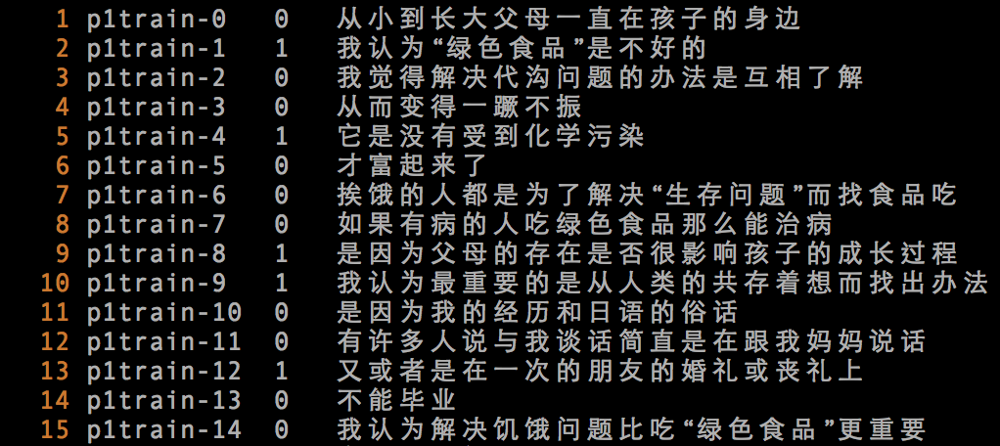
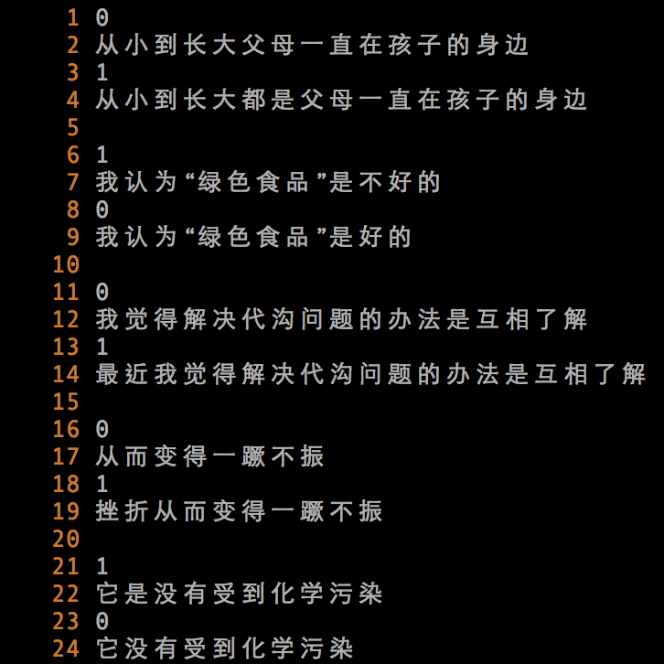
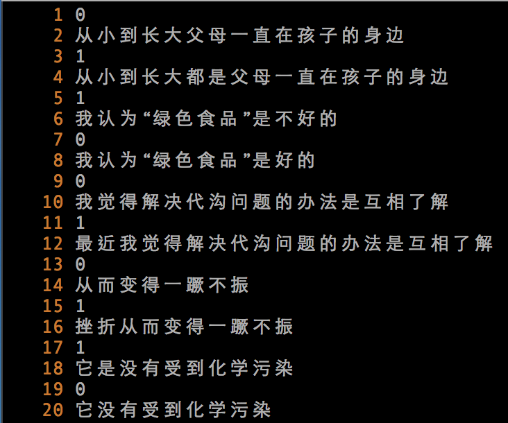

#Phase 1 Presentation

##Our Source Code

+ autorun.sh
+ 240365\_p1.train.txt
+ nlp.py
+ train\_cut.c
+ p1.test.txt
+ llh.py
+ recover.py

##What do they do

|Files|Functionality|Usage|
|:----|:-----------|:-----|
|autorun.sh|*it does everything for you*| |
|240365\_p1.train.txt|the given training data| |
|nlp.py|finding pairs?|`python nlp.py`|
|train\_cut.c|sentences => POS tags|compile with `gcc -I/usr/local/scws/include/scws -L/usr/local/scws/lib/ train_cut.c -lscws -o a.out` and run with `./a.out < [file full of sentences] > [file of POS tags of the sentences]`|
|p1.test.txt|the given test data| |
|llh.py|build up data set from training data and determine the answer to test data|`python llh.py [path to training data file] [path to test data file] [regular epsilon] [special epsilon]`
|recover.py|add sentence ID to tmp\_result.txt|`python recover.py`|

##Run

####Step1
```sh
python nlp.py | tr -s $'\n' > tmp1.txt
```







####Step2
```sh
gcc -I/usr/local/scws/include/scws -L/usr/local/scws/lib/ train_cut.c -lscws -o a.out
```

####Step3
```sh
./a.out < tmp1.txt | grep -B 1 "===" | grep -E "0|1|POS" > tmp_train.txt
```

####Step4
```sh
cat p1.test.txt | cut -d $'\t' -f 2 > tmp1.txt
```

####Step5
```sh
./a.out < tmp1.txt | grep -B 1 "===" | grep -E "0|1|POS" > tmp_test.txt
```

####Step6
```sh
python llh.py tmp_train.txt tmp_test.txt 2.0 3.0 > tmp_result.txt
```

####Step7
```sh
python recover.py > p1.result.txt
```

####Step8
```sh
rm -f a.out tmp1.txt tmp_result.txt tmp_test.txt tmp_train.txt
```


